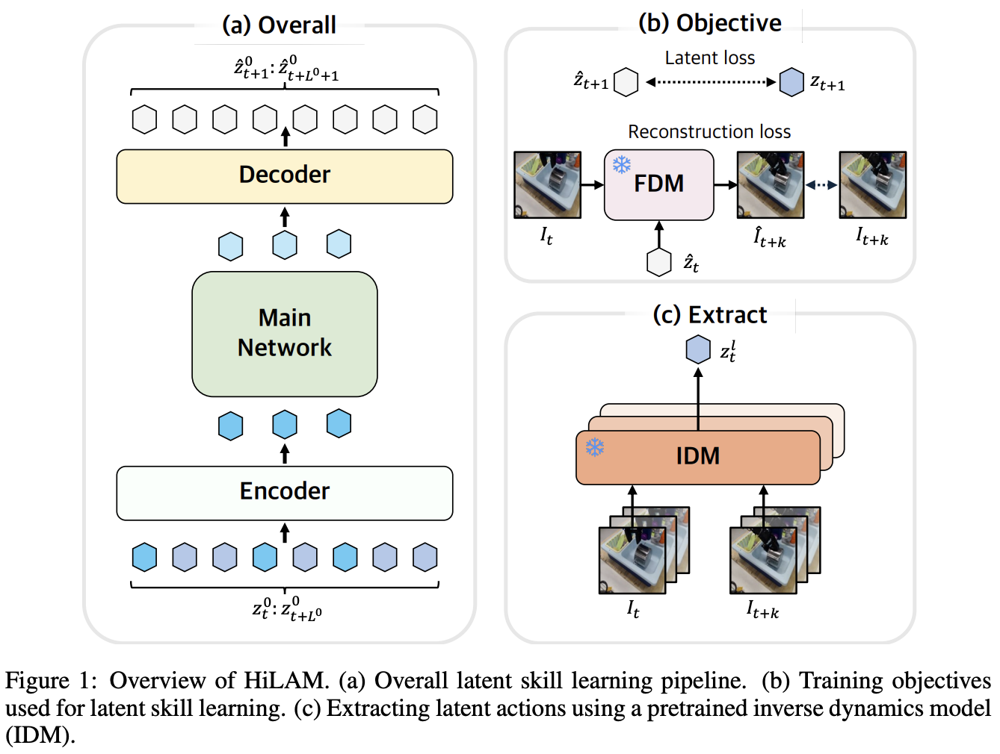

</img>

## HiLAM (wip)

Implementation of the [Hierarchical Latent Action Model](https://arxiv.org/abs/2603.05815), proposed by Hanjung Kim et al. of Yonsei University

## Citations

```bibtex
@misc{kim2026hierarchicallatentactionmodel,
    title   = {Hierarchical Latent Action Model},
    author  = {Hanjung Kim and Lerrel Pinto and Seon Joo Kim},
    year    = {2026},
    eprint  = {2603.05815},
    archivePrefix = {arXiv},
    primaryClass = {cs.RO},
    url     = {https://arxiv.org/abs/2603.05815},
}
```

```bibtex
@misc{schmidt2024learningactactions,
    title   = {Learning to Act without Actions},
    author  = {Dominik Schmidt and Minqi Jiang},
    year    = {2024},
    eprint  = {2312.10812},
    archivePrefix = {arXiv},
    primaryClass = {cs.LG},
    url     = {https://arxiv.org/abs/2312.10812},
}
```

```bibtex
@misc{hwang2025dynamicchunkingendtoendhierarchical,
    title   = {Dynamic Chunking for End-to-End Hierarchical Sequence Modeling},
    author  = {Sukjun Hwang and Brandon Wang and Albert Gu},
    year    = {2025},
    eprint  = {2507.07955},
    archivePrefix = {arXiv},
    primaryClass = {cs.LG},
    url     = {https://arxiv.org/abs/2507.07955},
}
```
